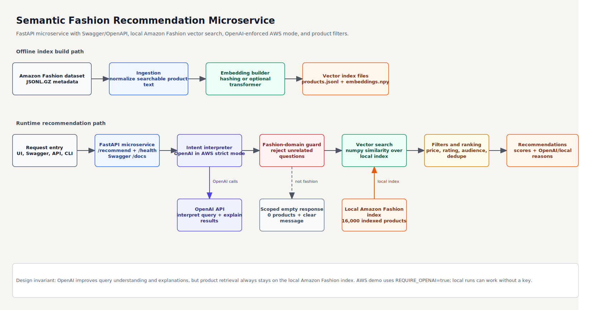
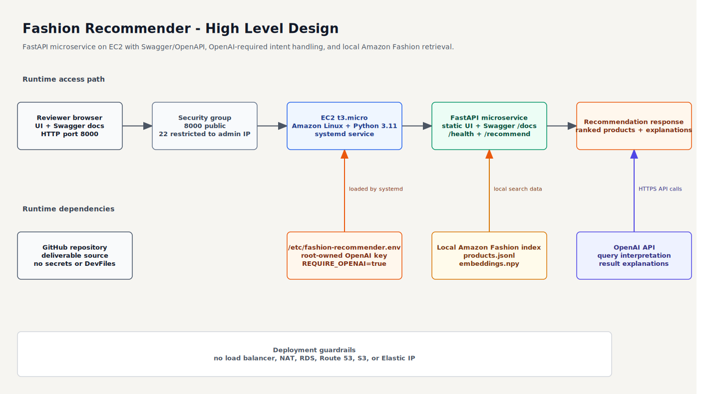
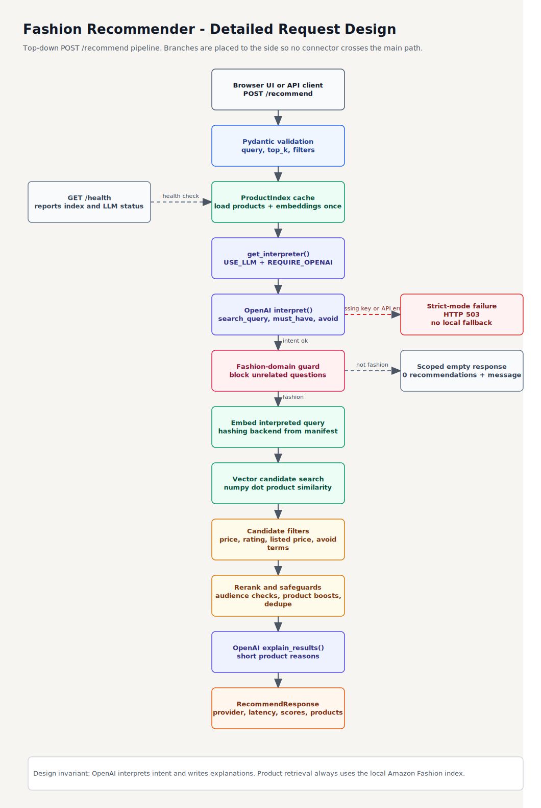

# Semantic Fashion Recommendation Microservice

Natural-language product recommendations for the Amazon Fashion metadata dataset.

This project is a take-home implementation of a semantic recommendation microservice for an e-commerce fashion product line. It accepts human-style shopping requests, interprets the intent, searches a local Amazon Fashion product index, and returns ranked product recommendations with concise reasons.

**Live UI app:** [http://13.206.145.228:8000/](http://13.206.145.228:8000/)

**Swagger API docs:** [http://13.206.145.228:8000/docs](http://13.206.145.228:8000/docs)

Example request:

```text
what should I wear to a beach wedding
```

Example behavior:

```text
OpenAI interprets the shopping intent.
The service searches the local Amazon Fashion sample index.
The response returns ranked fashion products with score, price, rating, and explanation.
```

## Live UI App

AWS UI app URL:

[http://13.206.145.228:8000/](http://13.206.145.228:8000/)

Swagger UI for the microservice API:

[http://13.206.145.228:8000/docs](http://13.206.145.228:8000/docs)

OpenAPI schema:

[http://13.206.145.228:8000/openapi.json](http://13.206.145.228:8000/openapi.json)

The demo is hosted on a single EC2 instance with `REQUIRE_OPENAI=true`, so hosted recommendation requests must use the OpenAI API for query interpretation and explanations. Product retrieval still uses the local Amazon Fashion index included in this repository.

The public IP may change if the EC2 instance is stopped or recreated because no Elastic IP is used.

## Documentation Web View

GitHub renders this README as an HTML page on the repository home page.

A standalone documentation page is also included at:

[https://javithsherif27.github.io/fashion-recommender/](https://javithsherif27.github.io/fashion-recommender/)

That page is served from `docs/index.html` when GitHub Pages is enabled for the repository.

## Assessment Coverage

| Requirement | Delivered |
| --- | --- |
| Parse natural-language fashion queries | OpenAI interpreter when configured, local deterministic interpreter for offline runs |
| Find relevant products from provided dataset | Local vector search over a prebuilt Amazon Fashion index |
| Expose functionality through function, CLI, or API | FastAPI microservice, Swagger/OpenAPI docs, CLI, and browser demo |
| Optional minimal front end | Included local UI served by FastAPI |
| Architecture diagram in JPEG or PDF | `docs/architecture.pdf` plus editable Draw.io sources |
| README with setup, sample usage, and trade-offs | This document |
| Additional exploration or documentation | Data profile, AWS deployment plan, HLD, detailed design diagrams, tests |

## Repository Contents

```text
app/
  main.py              FastAPI microservice, routes, Swagger/OpenAPI docs, health checks
  search.py            ProductIndex, vector search, filters, ranking
  llm.py               OpenAI/local query interpretation and explanations
  embedding.py         Hashing embedder and optional semantic embedder wiring
  ingest.py            Dataset normalization
  text_utils.py        Fashion query expansion and guard rules
  static/index.html    Browser demo UI

data/index/
  products.jsonl       Prebuilt indexed product records
  embeddings.npy       Prebuilt vector embeddings
  manifest.json        Index metadata

scripts/
  build_index.py       Rebuilds the vector index from the raw dataset

docs/
  architecture.pdf     Assessment-ready architecture diagram
  architecture.drawio  Editable architecture source
  hld.drawio           High-level design
  detailed-design.drawio
  aws-deployment-plan.md
  data_profile.md
  index.html           Standalone documentation web page

tests/
  Unit and API tests
```

## How It Works

### 1. Offline Index Build

The raw Amazon Fashion metadata is normalized into compact searchable text using fields such as title, features, description, store, and selected details.

The index builder then creates:

- `products.jsonl`: normalized product metadata used in responses
- `embeddings.npy`: vectors used for similarity search
- `manifest.json`: index metadata

The submitted repository already includes a 16,000-product index so reviewers can run the service immediately without downloading the raw dataset.

### 2. Query Interpretation

The service supports two interpretation modes:

- **Hosted AWS mode:** `REQUIRE_OPENAI=true` and `OPENAI_API_KEY` set. OpenAI must interpret the query. If the key is missing or the OpenAI call fails, the API returns HTTP `503` instead of silently falling back.
- **Local/offline mode:** no key required. The service uses deterministic fashion query expansion and still searches the local index.

OpenAI is used only for:

- rewriting natural-language shopping requests into compact fashion search intent
- producing short human-readable explanations for returned products

OpenAI does not replace the product search. Products always come from the local Amazon Fashion index.

### 3. Fashion-Domain Guard

Vector search always returns a nearest neighbor, even for unrelated questions. To avoid irrelevant recommendations, the service rejects non-fashion queries such as:

```text
what is Indias national anthem
how to cook rice
taj hotels
```

Valid compact fashion searches are still allowed, including:

```text
blue pink
gold earrings
men
maternity wear
waterproof hiking boots
what should I wear to a beach wedding
```

### 4. Vector Search, Filters, and Ranking

For valid fashion requests, the service:

1. Embeds the interpreted query.
2. Computes vector similarity with the local product index.
3. Applies price, rating, and listed-price filters.
4. Removes audience mismatches, such as women-only products for a men-only query.
5. Boosts explicit product type matches.
6. Deduplicates products.
7. Returns the top recommendations with scores and reasons.

## Project Setup: Local Source Setup And Run

Use Python 3.10 or newer. Python 3.11 is recommended.

The repository already includes a prebuilt 16,000-product sample index under `data/index`, so a reviewer can run the microservice immediately without downloading the raw dataset. Download the raw dataset only if you want to rebuild the index.

### 1. Get The Source

From GitHub:

```powershell
git clone https://github.com/javithsherif27/fashion-recommender.git
cd fashion-recommender
```

From the submitted local folder:

```powershell
cd D:\source-code\2026\ProdaptAssignment\ProdaptAssignment
```

### 2. Create A Virtual Environment

Windows PowerShell:

```powershell
python -m venv .venv
.\.venv\Scripts\python -m pip install --upgrade pip
.\.venv\Scripts\python -m pip install -r requirements.txt
```

macOS or Linux:

```bash
python3 -m venv .venv
source .venv/bin/activate
python -m pip install --upgrade pip
python -m pip install -r requirements.txt
```

### 3. Start The Microservice

Windows PowerShell:

```powershell
.\.venv\Scripts\python -m uvicorn app.main:app --reload --port 8000
```

macOS or Linux:

```bash
python -m uvicorn app.main:app --reload --port 8000
```

### 4. Open The Local Endpoints

```text
Local UI:        http://127.0.0.1:8000
Swagger UI:      http://127.0.0.1:8000/docs
OpenAPI schema:  http://127.0.0.1:8000/openapi.json
Health check:    http://127.0.0.1:8000/health
```

### 5. Run A Local API Request

PowerShell:

```powershell
Invoke-RestMethod `
  -Uri http://127.0.0.1:8000/recommend `
  -Method Post `
  -ContentType "application/json" `
  -Body '{"query":"what should I wear to a beach wedding","top_k":5,"filters":{"require_price":true}}'
```

curl:

```bash
curl -X POST http://127.0.0.1:8000/recommend \
  -H "Content-Type: application/json" \
  -d '{"query":"what should I wear to a beach wedding","top_k":5,"filters":{"require_price":true}}'
```

### 6. Run Tests

Windows PowerShell:

```powershell
.\.venv\Scripts\python -m pytest
```

macOS or Linux:

```bash
python -m pytest
```

## Optional OpenAI Configuration

Do not hardcode API keys in source code.

For local testing:

```powershell
$env:OPENAI_API_KEY="your-key-here"
$env:OPENAI_MODEL="gpt-4o-mini"
$env:USE_LLM="auto"
```

For hosted AWS strict mode:

```bash
OPENAI_API_KEY=your-key-here
OPENAI_MODEL=gpt-4o-mini
USE_LLM=auto
REQUIRE_OPENAI=true
INDEX_DIR=data/index
EMBEDDING_BACKEND=auto
```

In strict mode, `/health` should show:

```json
{
  "llm_configured": true,
  "llm_required": true
}
```

## Sample Usage

Interactive Swagger UI:

```text
http://127.0.0.1:8000/docs
```

OpenAPI schema:

```text
http://127.0.0.1:8000/openapi.json
```

Health check:

```powershell
Invoke-RestMethod -Uri http://127.0.0.1:8000/health
```

Recommendation request:

```powershell
Invoke-RestMethod `
  -Uri http://127.0.0.1:8000/recommend `
  -Method Post `
  -ContentType "application/json" `
  -Body '{"query":"what should I wear to a beach wedding","top_k":5,"filters":{"require_price":true}}'
```

Response shape:

```json
{
  "query": "what should I wear to a beach wedding",
  "interpreted_query": "beach wedding attire, light dresses, linen suits...",
  "llm_used": true,
  "llm_provider": "openai",
  "embedding_backend": "hashing",
  "recommendations": [
    {
      "parent_asin": "B09V1C2J3H",
      "title": "Women's Summer Casual T Shirt Mini Dresses with Pockets Lace Puff Sleeve Swing Dress",
      "store": "KOJOOIN",
      "price": 26.99,
      "average_rating": 4.1,
      "rating_number": 65,
      "score": 0.5458,
      "why": "A lightweight summer dress suitable for a beach wedding."
    }
  ],
  "latency_ms": 5386,
  "message": null
}
```

Out-of-domain response:

```json
{
  "query": "what is Indias national anthem",
  "interpreted_query": "what is Indias national anthem",
  "llm_used": false,
  "llm_provider": "local",
  "embedding_backend": "hashing",
  "recommendations": [],
  "latency_ms": 0,
  "message": "This service is scoped to fashion product recommendations. Try a clothing item, accessory, season, occasion, or audience request."
}
```

## CLI Usage

```powershell
.\.venv\Scripts\python -m app.cli recommend "comfortable running socks for training" --top-k 5 --min-rating 4
```

## Rebuilding The Index

The repo includes a prebuilt sample index. To rebuild it from the assignment dataset, place the downloaded file in the project root as:

```text
meta_Amazon_Fashion.jsonl.gz
```

Then run:

```powershell
.\.venv\Scripts\python scripts\build_index.py --input meta_Amazon_Fashion.jsonl.gz --index-dir data\index --max-records 16000
```

Use `--max-records 0` to build against the full dataset.

## Supported Search Criteria

The query guard and expansion rules support:

- product types: `linen shirt`, `gold earrings`, `leather wallet`
- audience searches: `men`, `women`, `kids school shoes`, `maternity wear`
- occasion searches: `date night`, `black tie wedding outfit`, `office interview outfit`
- activity searches: `running socks`, `yoga leggings`, `hiking boots`
- weather searches: `winter travel clothes`, `rain jacket`, `waterproof hiking boots`
- attributes: colors, patterns, materials, fit, size, style, and features
- natural-language styling questions: `what should I wear to a beach wedding`

## Architecture And Design Documents

Assessment-ready architecture PDF:

- `docs/architecture.pdf`

Diagram previews:







Editable diagrams:

- `docs/architecture.drawio`
- `docs/hld.drawio`
- `docs/detailed-design.drawio`

Supporting documentation:

- `docs/aws-deployment-plan.md`
- `docs/data_profile.md`
- `docs/index.html`

GitHub renders this `README.md` as an HTML page on the repository home page. The standalone `docs/index.html` file is also included for a browser-style documentation view.

## AWS Deployment Summary

The current AWS deployment is intentionally simple:

```text
Reviewer browser
  -> EC2 public IP on port 8000
  -> FastAPI app
  -> root-owned /etc/fashion-recommender.env
  -> local Amazon Fashion index
  -> OpenAI API for query interpretation and explanations
```

Deployment guardrails used:

- single EC2 instance
- small EC2 instance type selected for the demo
- small root EBS volume
- no load balancer
- no NAT Gateway
- no RDS
- no Route 53
- no AWS Secrets Manager
- no Elastic IP

The OpenAI API cost is separate from AWS.

## Design Decisions And Trade-Offs

- **FastAPI service:** small, reviewable, and enough for API plus UI delivery.
- **Local vector index:** avoids needing a vector database for a take-home prototype.
- **Prebuilt sample index:** lets reviewers run the project immediately.
- **Hashing embeddings by default:** keeps the app runnable without large model downloads.
- **Optional transformer embeddings:** available through `requirements-semantic.txt` if stronger local embeddings are desired.
- **OpenAI as interpretation layer:** improves natural-language handling while preserving the assignment requirement to search the provided dataset.
- **Fashion-domain guard:** prevents nearest-neighbor search from returning random products for unrelated questions.
- **Listed-price filter:** handles source-data reality because many Amazon Fashion rows do not include price.

## Data Notes

The source dataset contains 826,108 rows. Field coverage is uneven:

- all rows have category, rating, rating count, and parent ASIN
- most rows have title, store, images, and details
- fewer rows have long descriptions or price

Because `categories` are often empty in sampled rows, the implementation uses title, features, description, store, and selected details as the main searchable product text.

## Tests

Run:

```powershell
.\.venv\Scripts\pytest
```

Covered areas:

- ingestion and index creation
- API health and recommendation flow
- OpenAI-required strict mode behavior
- fashion-domain guard behavior
- price/rating/listed-price filters
- audience filtering
- product-type ranking
- supported fashion query criteria

Current verification result:

```text
50 passed
```

## Known Limitations

- The included index is a 16,000-product sample, not the full 826,108-row dataset.
- The default hashing embedder is lightweight and deterministic, but less semantically rich than transformer embeddings.
- The AWS demo uses HTTP and public IP for simplicity, not HTTPS or a domain.
- The public IP is not stable if the EC2 instance is stopped or recreated.
- The service is a prototype and does not include authentication, rate limiting, observability, or a production vector database.

## Future Improvements

- Build the full dataset index.
- Add a persistent vector database such as FAISS, Qdrant, OpenSearch, or pgvector.
- Add image thumbnails to the UI using product image metadata.
- Add structured OpenAI classification for `is_fashion_request` while retaining the local guard as a safety layer.
- Add CI for tests and diagram validation.
- Add HTTPS and a stable domain for production-style hosting.
